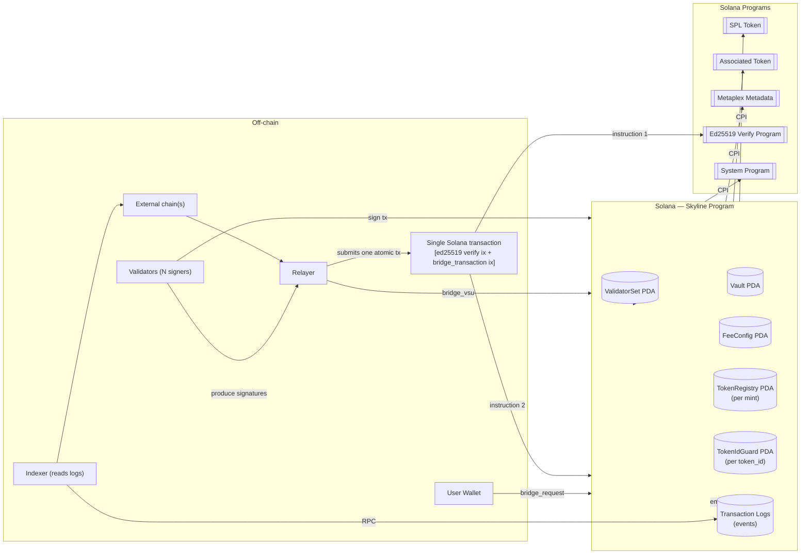
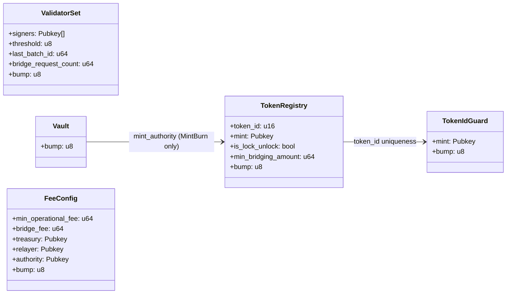

# Skyline Program — Instructions Spec

This document describes the on-chain instruction handlers for the Skyline Solana program.

Skyline implements a validator-governed cross-chain bridge using:
- a **ValidatorSet** PDA that stores governance state (validator keys, BFT threshold, batch counter), and
- a **Vault** PDA that acts as the program's authority for minting and transferring tokens.

Two token modes are supported per registered mint:
1. **Lock/Unlock** — tokens are transferred into the vault on outbound, released from the vault on inbound (e.g. USDC, WSOL).
2. **Mint/Burn** — tokens are burned from the user on outbound, minted to the recipient on inbound (vault is mint authority).

---

## Key Concepts

### Validator consensus

Validator consensus is required for two operations:
1. Settling an inbound bridge transfer onto Solana (`bridge_transaction`).
2. Changing the validator set (`bridge_vsu`).

`bridge_transaction` and `bridge_vsu` use different signer sources:
- `bridge_transaction`: validator pubkeys are extracted from a neighboring `ed25519` verify instruction (via the instructions sysvar), then deduplicated and checked against `validator_set.signers`.
- `bridge_vsu`: validator signer accounts are passed in `remaining_accounts` with `is_signer = true`, then deduplicated and membership-checked.

For both instructions, quorum is enforced as:
- number of valid approvals must be `>= validator_set.threshold`.

Consensus is resolved in **a single transaction** — there is no multi-round accumulation PDA.

### BFT threshold

```
threshold = n - floor((n - 1) / 3)
```

Tolerates up to `floor((n-1)/3)` Byzantine validators. Examples: n=4 → t=3, n=7 → t=5, n=10 → t=7.

### Batch IDs and replay protection

Both `bridge_transaction` and `bridge_vsu` use a shared monotonically increasing `batch_id` stored in `ValidatorSet.last_batch_id`. The constraint `last_batch_id < batch_id` is enforced; on completion `last_batch_id = batch_id` is written. This prevents replays and enforces total ordering of all consensus operations.

### Events as outbound messages

`bridge_request` emits `BridgeRequestEvent`. Validators and relayers index these events off-chain to drive actions on the destination chain.

---

## Architecture Overview

<details>
<summary>View Diagram</summary>


</details>

---

## Program State (Accounts)

### `ValidatorSet` (PDA)
**Seeds:** `[b"validator-set"]`

| Field | Type | Description |
|-------|------|-------------|
| `signers` | `Vec<Pubkey>` | Current validator public keys (4–128) |
| `threshold` | `u8` | Required approval count (BFT formula) |
| `bump` | `u8` | PDA bump |
| `last_batch_id` | `u64` | Replay-protection pointer |
| `bridge_request_count` | `u64` | Outbound request counter |

### `Vault` (PDA)
**Seeds:** `[b"vault"]`

| Field | Type | Description |
|-------|------|-------------|
| `bump` | `u8` | PDA bump |

The Vault PDA is the signing authority for all token CPIs: `mint_to`, `transfer_checked` from vault ATA, and burn (as mint authority for MintBurn tokens). It is also the `mint_authority` and `freeze_authority` for every MintBurn token.

### `FeeConfig` (PDA)
**Seeds:** `[b"fee_config"]`

| Field | Type | Description |
|-------|------|-------------|
| `min_operational_fee` | `u64` | Minimum lamports sent to treasury per `bridge_request` |
| `bridge_fee` | `u64` | Lamports sent to relayer per `bridge_request` (destination gas estimate) |
| `treasury` | `Pubkey` | Receives `fee - bridge_fee` on every `bridge_request` |
| `relayer` | `Pubkey` | Receives `bridge_fee` on every `bridge_request` |
| `authority` | `Pubkey` | Who can update this config |
| `bump` | `u8` | PDA bump |

### `TokenRegistry` (PDA)
**Seeds:** `[b"token_registry", mint.key()]`

One per registered mint. Determines the bridge mechanic for that mint.

| Field | Type | Description |
|-------|------|-------------|
| `token_id` | `u16` | Gateway-compatible identifier |
| `mint` | `Pubkey` | The SPL mint this entry corresponds to |
| `is_lock_unlock` | `bool` | `true` = Lock/Unlock, `false` = Mint/Burn |
| `min_bridging_amount` | `u64` | Minimum raw token amount per `bridge_request` |
| `bump` | `u8` | PDA bump |

### `TokenIdGuard` (PDA)
**Seeds:** `[b"token_id_guard", token_id.to_le_bytes()]`

Uniqueness sentinel: its existence proves the `token_id` slot is taken. Created by Anchor `init` — a second registration attempt with the same `token_id` fails automatically.

| Field | Type | Description |
|-------|------|-------------|
| `mint` | `Pubkey` | The mint that owns this token_id |
| `bump` | `u8` | PDA bump |

### State / Accounts Model

<details>
<summary>View Diagram</summary>


</details>

---

## Instruction Specifications

### 1) `initialize`

```
initialize(validators: Vec<Pubkey>, last_id: Option<u64>, min_operational_fee: u64, bridge_fee: u64)
```

**Purpose:** One-time bootstrap. Creates `ValidatorSet`, `Vault`, and `FeeConfig` PDAs.

**Caller:** Any signer (becomes `fee_config.authority`). Runs once — PDA `init` prevents re-initialization.

**Required accounts:** `signer`, `validator_set`, `vault`, `fee_config`, `treasury`, `relayer`, `system_program`

**Validation:**
- `4 <= validators.len() <= 128`
- All `validators` must be unique
- `treasury` and `relayer` must not be `Pubkey::default()`
- `min_operational_fee + bridge_fee` must not overflow `u64`

**State changes:**
- `validator_set.signers = validators`
- `validator_set.threshold = calculate_threshold(validators.len())`
- `validator_set.last_batch_id = last_id` (defaults to 0)
- `validator_set.bridge_request_count = 0`
- `fee_config.{min_operational_fee, bridge_fee, treasury, relayer, authority}` initialised

---

### 2) `bridge_request`

```
bridge_request(amount: u64, receiver: String, destination_chain: String, fees: u64)
```

**Purpose:** Outbound bridge request. Pays SOL fees, then locks or burns tokens, emitting an event for validators.

**Caller:** End user.

**Required accounts:** `signer`, `validator_set`, `signers_ata`, `vault`, `vault_ata`, `mint`, `token_registry`, `token_program`, `system_program`, `associated_token_program`, `fee_config`, `treasury`, `relayer`

**Fee flow (SOL):**
- `bridge_fee → relayer`
- `fees - bridge_fee → treasury` (must be `>= min_operational_fee`)

**Token flow:**
| `is_lock_unlock` | Action |
|-----------------|--------|
| `false` (MintBurn) | Burn `amount` from `signers_ata`; vault is mint authority |
| `true` (LockUnlock) | Create vault ATA if absent; transfer `amount` from `signers_ata` to vault ATA |

**Validation:**
- `amount >= token_registry.min_bridging_amount`
- `fees >= min_operational_fee + bridge_fee`
- User ATA must match `(mint, signer)`
- `vault_ata` must be the canonical ATA for `(vault, mint)`

**Emits:** `BridgeRequestEvent { sender, amount, receiver, destination_chain, mint_token, bridge_fee, operational_fee }`

**State changes:** `validator_set.bridge_request_count += 1`

---

### 3) `bridge_transaction`

```
bridge_transaction()
```

**Purpose:** Inbound batch settlement. Mints or releases tokens to up to 5 recipients in one transaction after validator quorum is met.

**Caller:** Relayer (pays rent for any new recipient ATAs).

**Consensus source:** Validator approvals and the full batch intent (`receivers`, `fee_amount`, `batch_id`, `blockhash`) are read from a neighboring `ed25519` verification instruction (`sendtx.SolanaPayload` in the signed message). Validator signer accounts are **not** part of `remaining_accounts`.

On-chain, receivers are turned into `TransferItem` entries and a deduplicated mint list (same mint-index rules as the Go relayer). **`remaining_accounts` must still match that derived layout** — mints, wallets, registries, ATAs, vault ATAs in the documented order.

**`remaining_accounts` layout (strict positional):**

```
[ mint accounts | recipient wallets | token registries | recipient ATAs | vault ATAs ]
    ^num_mints      ^num_transfers    ^num_mints         ^num_transfers   ^num_mints
```

Sections are fully positional and sized from `mints.len()` and `transfers.len()`. Every account address is validated against its canonical/expected value before use.

**Validation:**
- `1 <= transfers.len() <= 5`
- `1 <= mints.len() <= transfers.len()` (every mint referenced by at least one transfer)
- All `mint_index` values in bounds; all `amount` values > 0
- `batch_id > validator_set.last_batch_id`
- A neighboring `ed25519` verify instruction must be present (immediately before or after) and provide at least one signer pubkey
- Extracted signer pubkeys must be deduplicated, all registered validators, and count `>= threshold`
- Each `TokenRegistry` PDA address verified before deserialisation
- Each mint account key must match the `mints` argument at the same index
- Each recipient wallet account must match `TransferItem.recipient` at the same transfer index
- Each recipient ATA and vault ATA address verified against derived values

**Token flow per transfer:**
| `registry.is_lock_unlock` | Action |
|--------------------------|--------|
| `false` (MintBurn) | `mint_to` recipient ATA (vault signs as mint authority) |
| `true` (LockUnlock) | `transfer_checked` from vault ATA to recipient ATA (vault signs) |

Recipient ATAs are created on-demand (funded by `payer`).

**Emits:** `TransactionExecutedEvent { batch_id, transfer_count }`

**State changes:** `validator_set.last_batch_id = batch_id`

---

### 4) `bridge_vsu`

```
bridge_vsu(added: Vec<Pubkey>, removed: Vec<Pubkey>, batch_id: u64)
```

**Purpose:** Change the validator set (add/remove validators) with quorum approval in a single transaction.

**Caller:** Anyone pays; validators co-sign via `remaining_accounts`.

**Required accounts:** `payer`, `validator_set`, `system_program`

**Validation:**
- `batch_id > validator_set.last_batch_id`
- No duplicates within `added`; no duplicates within `removed`
- No pubkey appears in both `added` and `removed`
- All `removed` pubkeys must exist in `validator_set.signers`
- All `added` pubkeys must not exist in `validator_set.signers`
- Resulting validator count satisfies `4 <= count <= 128`
- Validator signers (from `remaining_accounts`): non-empty, deduplicated, all registered, count `>= threshold`

**Execution:**
- Removes all pubkeys in `removed` from `validator_set.signers`
- Appends all pubkeys in `added`
- Recomputes `threshold`

**Emits:** `ValidatorSetUpdatedEvent { new_signers, new_threshold, batch_id }`

**State changes:** `validator_set.signers`, `validator_set.threshold`, `validator_set.last_batch_id = batch_id`

---

### 5) `update_fee_config`

```
update_fee_config(
    min_operational_fee: Option<u64>,
    bridge_fee: Option<u64>,
    update_treasury: Option<bool>,
    update_relayer: Option<bool>
)
```

**Purpose:** Update fee configuration. All parameters are optional — `None` keeps the existing value.

**Caller:** `fee_config.authority` only (`has_one` constraint).

**Required accounts:** `authority`, `fee_config`, `new_treasury`, `new_relayer`

**Validation:**
- `new_op_fee + new_bridge_fee` must not overflow `u64`
- If updating treasury: `new_treasury.key() != Pubkey::default()`
- If updating relayer: `new_relayer.key() != Pubkey::default()`

To update treasury or relayer: pass the new address in the account field AND `Some(true)` in the flag. Passing `None` for the flag keeps the existing address.

**Emits:** `FeeConfigUpdatedEvent { min_operational_fee, bridge_fee, treasury, relayer }`

---

### 6) `register_lock_unlock_token`

```
register_lock_unlock_token(token_id: u16, min_bridging_amount: u64)
```

**Purpose:** Whitelist a pre-existing SPL mint (e.g. USDC, WSOL) for bridging via lock/unlock.

**Caller:** `fee_config.authority` only.

**Required accounts:** `authority`, `fee_config`, `mint`, `token_registry`, `token_id_guard`, `system_program`

**What it does:**
- Creates `TokenRegistry` PDA with `is_lock_unlock = true`
- Creates `TokenIdGuard` PDA to reserve the `token_id`

**Duplicate prevention:** Both PDAs use Anchor `init` — attempting to register the same mint or the same `token_id` a second time fails automatically.

**Emits:** `LockUnlockTokenRegisteredEvent { token_id, mint, min_bridging_amount }`

---

### 7) `register_mint_burn_token`

```
register_mint_burn_token(token_id: u16, decimals: u8, min_bridging_amount: u64, name: String, symbol: String, uri: String)
```

**Purpose:** Create a new SPL mint with the Vault as mint authority, attach Metaplex metadata, and whitelist it for bridging via mint/burn.

**Caller:** `fee_config.authority` only.

**Required accounts:** `authority`, `fee_config`, `vault`, `mint` (new keypair, signer), `metadata`, `token_registry`, `token_id_guard`, `token_program`, `metadata_program`, `system_program`, `rent`

**What it does:**
1. Creates the SPL mint (via Anchor `init`) with `mint_authority = vault`, `freeze_authority = vault`
2. Creates Metaplex metadata via CPI (`update_authority = vault`, `is_mutable = true`)
3. Creates `TokenRegistry` PDA with `is_lock_unlock = false`
4. Creates `TokenIdGuard` PDA to reserve the `token_id`

**Emits:** `MintBurnTokenRegisteredEvent { token_id, mint, name, symbol }`
