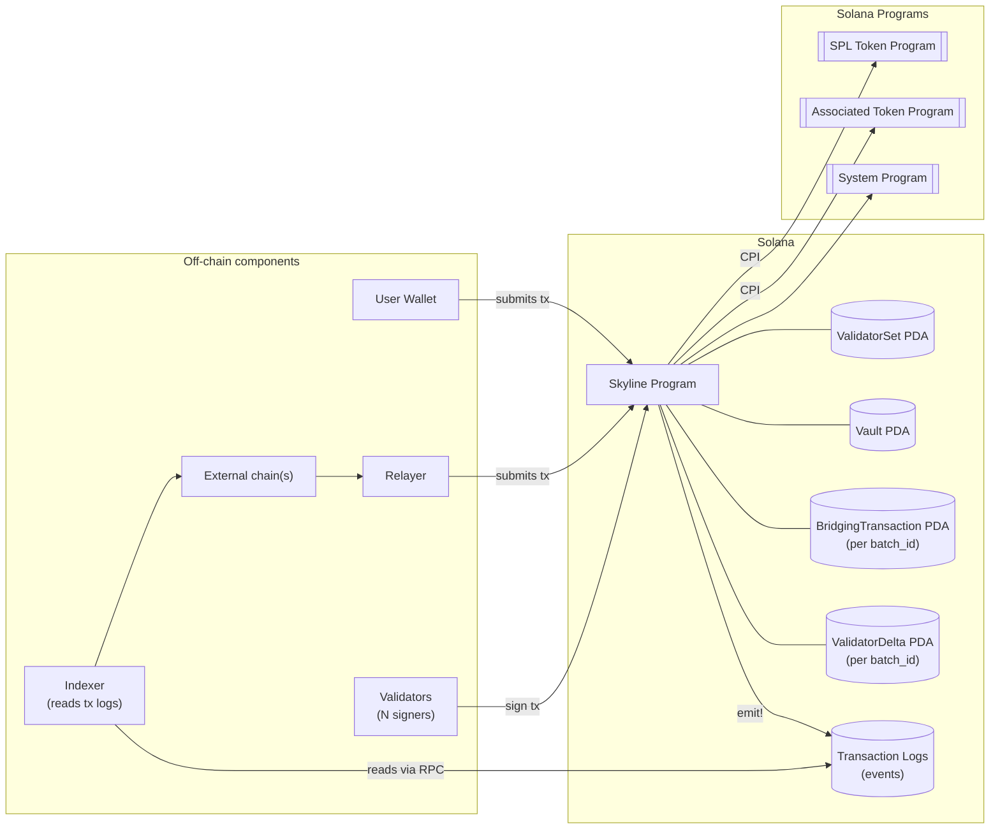
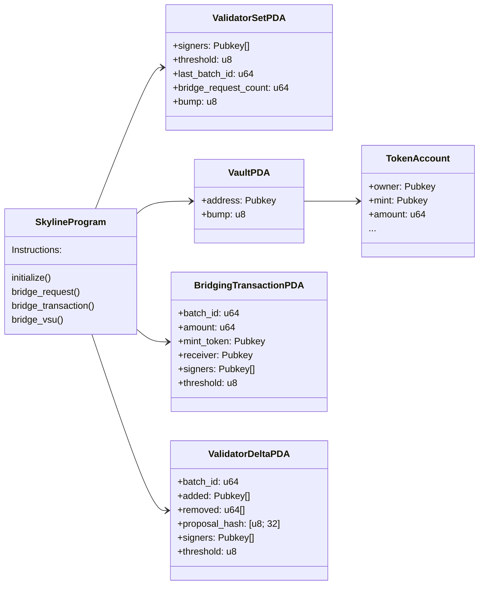

# Instructions Spec

This spec contains the on-chain instruction handlers for the Skyline Solana program.

At a high level, Skyline implements a validator-governed bridge workflow using:
- a **ValidatorSet** PDA that stores bridge governance state (validator keys, threshold, bump, batch counters), and
- a **Vault** PDA that acts as the program’s authority for minting and/or transferring tokens.

The bridge supports two modes:
1. **Burn / Lock mode**: tokens are burned (if the vault is mint authority) or transferred from the sender’s token account into the vault’s token account (if the vault is not mint authority). This is an outbound flow (Solana => other chain).
2. **Mint / Release mode**: tokens are minted to recipient’s token account (if vault is mint authority) or transferred from the vault’s token account into the recipient’s token account (if the vault is not mint authority). This is an inbound flow (other chain => Solana).

## Key Concepts

### Validator consensus
Validator consensus plays a critical role in two cases:
1. A bridge transaction lands on Solana from another chain.
2. The validator set needs to be updated.

In both cases, the program follows the same high-level approval pattern:
- Validator signer accounts are passed via `remaining_accounts`.
- The program collects accounts with `is_signer == true`.
- It validates those signers are members of already stored `validator_set.signers`.
- It enforces a quorum: the number of valid validator approvals must be `>= validator_set.threshold`.

### Batch IDs and replay protection
Inbound execution instructions use a monotonically increasing `batch_id` with:
- a stored batch_id: `validator_set.last_batch_id`
- a constraint: `validator_set.last_batch_id < batch_id`

When an instruction completes, it updates `last_batch_id = batch_id`.

This provides on-chain replay protection, assuming `batch_id` is globally coordinated off-chain.

### Events as outbound messages
Outbound bridge requests emit `BridgeRequestEvent` event. Validators/relayers index these events off-chain to drive actions on other chains.

## Architecture overview

View Diagram

## Program State (Accounts)

### `ValidatorSet` (PDA)
**Seeds:** `[VALIDATOR_SET_SEED]`

Holds:
- `signers: Vec<Pubkey>` — current validator keys
- `threshold: u8` — required approvals (computed via `helpers::calculate_threshold`)
- `bump: u8`
- `last_batch_id: u64` — replay-protection pointer for validator-executed operations
- `bridge_request_count: u64` — outbound request counter used in events

### `Vault` (PDA)
**Seeds:** `[VAULT_SEED]`

Holds:
- `address: Pubkey` — its own PDA address
- `bump: u8`

The Vault PDA is used as the signing authority (via seeds) for:
- SPL `mint_to` when it is mint authority, or
- SPL `transfer` from the vault’s token account when it is not mint authority.

### `BridgingTransaction` (PDA, per batch)
**Seeds:** `[BRIDGING_TRANSACTION_SEED, batch_id.to_le_bytes()]`

Created with `init_if_needed` and used to:
- store the proposed transfer details (amount, receiver, mint, batch_id)
- accumulate validator approvals across multiple transactions
- execute once quorum is reached
- close itself after execution (rent refund to payer)

### `ValidatorDelta` (PDA, per batch)
**Seeds:** `[VALIDATOR_SET_CHANGE_SEED, batch_id.to_le_bytes()]`

Created with `init_if_needed` and used to:
- store a validator-set change proposal (`added`, `removed`, `proposal_hash`)
- accumulate validator approvals across multiple transactions
- apply the change once quorum is reached
- close itself after execution (rent refund to payer)

### State / Accounts Model

View Diagram

## Instruction Specifications

### 1) `initialize(validators: Vec<Pubkey>, last_id: u64)`
**Purpose:** Bootstrap the bridge by creating the `ValidatorSet` PDA and the `Vault` PDA.

**Caller:** Admin/initializer (any signer who funds initialization; only runnable once due to PDA `init`).

**State changes:**
- sets `validator_set.signers = validators`
- sets `validator_set.threshold = helpers::calculate_threshold(validators.len())`
- sets `validator_set.last_batch_id = last_id`
- sets `validator_set.bridge_request_count = 0`
- stores bumps
- initializes vault metadata

**Validation rules:**
- `MIN_VALIDATORS <= validators.len() <= MAX_VALIDATORS`
- all `validators` must be unique

### 2) `bridge_request(amount: u64, receiver: Vec<u8>, destination_chain: u8)`
**Purpose:** Create an outbound bridge request from Solana to a destination chain by either burning tokens or transferring them into vault custody, then emitting an event.

**Caller:** End user.

**Token flow:**
- If Vault PDA is mint authority for `mint`:
  - burn `amount` from user’s ATA
- Else:
  - create vault ATA for `(vault, mint)` if needed
  - transfer `amount` from user ATA to vault ATA

**Outputs:**
- emits `BridgeRequestEvent` including:
  - `sender` (Solana pubkey)
  - `amount`
  - `receiver` (destination address bytes)
  - `destination_chain`
  - `mint_token`
  - `batch_request_id = validator_set.bridge_request_count`

**State changes:**
- increments `validator_set.bridge_request_count`

**Validation rules:**
- user ATA must match `(mint, signer)`
- user must have sufficient balance
- when transferring, the provided `vault_ata` must validate as the correct token account for `(vault, mint)`

### 3) `bridge_transaction(amount: u64, batch_id: u64)`
**Purpose:** Execute an inbound bridge settlement onto Solana (mint or release tokens) after validator quorum approval, using a per-batch approval accumulator.

**Caller:** Anyone, but in practice Relayer (the `payer`) funds PDA/ATA creation and acts as a tx signer. Validators approve by being transaction signers in `remaining_accounts`.

**Anti-replay:**
- requires `validator_set.last_batch_id < batch_id`
- on successful execution sets `validator_set.last_batch_id = batch_id`

**Approval accumulation:**
- First call creates `BridgingTransaction` and stores `(amount, receiver, mint_token, batch_id)`
- Subsequent calls must match those stored values
- Each call can add approvals from validator signers in `remaining_accounts`
- Enforces:
  - at least one signer provided
  - no duplicate signer keys in a single call
  - signers must be members of `validator_set.signers`
  - signers cannot approve twice (checked against stored approvals)

**Execution (once quorum reached):**
- create recipient ATA for `(recipient, mint_token)` if needed
- if Vault PDA is mint authority:
  - `mint_to` recipient ATA signed by Vault PDA seeds
- else:
  - validate the provided vault token account for `(vault, mint_token)`
  - transfer from vault token account to recipient ATA signed by Vault PDA seeds
- emits `TransactionExecutedEvent { transaction_id, batch_id }`
- closes the `BridgingTransaction` PDA (refunds rent to payer)

**State changes:**
- updates `validator_set.last_batch_id`
- closes `bridging_transaction` PDA

### 4) `bridge_vsu(added: Vec<Pubkey>, removed: Vec<u64>, batch_id: u64)`
**Purpose:** Propose and apply a validator set update (add/remove validators) after quorum approval, using a per-batch approval accumulator.

**Caller:** Anyone, but in practice Relayer (the `payer`) funds PDA creation. Validators approve by being transaction signers in `remaining_accounts`.

**Anti-replay:**
- requires `validator_set.last_batch_id < batch_id`
- on successful execution sets `validator_set.last_batch_id = batch_id`

**Proposal integrity:**
- computes `proposal_hash = hash( concat(added_pubkeys_bytes) || concat(removed_u64_bytes) )`
- first call stores the proposal details in `ValidatorDelta`
- subsequent calls must match the stored `proposal_hash`

**Validation rules (on first proposal creation):**
- cannot add a pubkey already present in `validator_set.signers`
- removed indices must be in-bounds of the current signer list
- resulting signer count must satisfy `MIN_VALIDATORS..=MAX_VALIDATORS`

**Approval accumulation:**
- at least one signer provided
- no duplicate signer keys in a single call
- signers must be current validators
- signers cannot approve twice

**Execution (once quorum reached):**
- sorts removal indices descending and removes by index
- appends added pubkeys
- recomputes `validator_set.threshold`
- emits `ValidatorSetUpdatedEvent { new_signers, new_threshold, batch_id }`
- updates `validator_set.last_batch_id`
- closes the `ValidatorDelta` PDA (refunds rent to payer)

